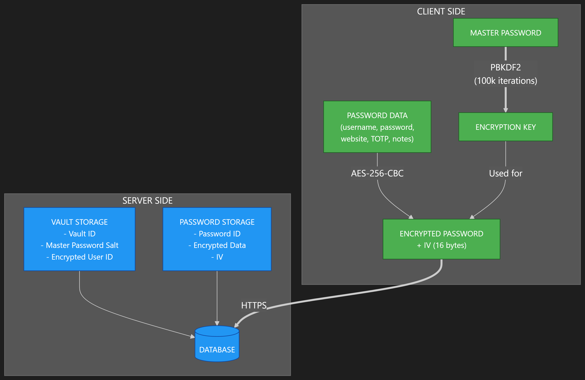

# Secure Password Manager

**DISCLAIMER: THIS IS ONLY A PROOF OF CONCEPT APPLICATION AND SHOULD NOT BE USED AS AN ACTUAL PASSWORD MANAGER. NONE OF THE CONTRIBUTORS ARE LIABLE FOR ANY DAMAGES DUE TO THE USE OF THIS SOFTWARE**  
Feel free to check the code and point out any possible vulnerabilities or problems. I'm always happy to learn.  
  
A full-stack, secure password manager application with client-side encryption, vault management, and password organization.

## Features

- **Secure Authentication**: User registration and login with secure password hashing
- **Vault Management**: Create and manage multiple password vaults, each with its own master password
- **Client-Side Encryption**: All sensitive data is encrypted/decrypted locally in the browser
- **Password Organization**: Store, view, edit, and delete passwords in a user-friendly interface
- **Website Metadata**: Automatically fetch website icons and titles for better organization
- **Two-Factor Authentication Support**: Store TOTP secrets for 2FA-enabled accounts
- **Copy to Clipboard**: Easily copy usernames, passwords, and other fields
- **Notes Storage**: Add custom notes to password entries

## Security Model

This password manager implements a zero-knowledge security model:

- **Client-Side Encryption**: All sensitive data is encrypted/decrypted in the browser using AES-256-CBC
- **Master Password**: Never sent to the server, used only for key derivation
- **Key Derivation**: PBKDF2 with 100,000 iterations for secure key generation
- **Verification**: Encrypted user ID used to verify correct master password
- **Session Management**: JWT-based authentication with secure cookie storage



## Tech Stack

### Frontend
- **Framework**: Next.js 15
- **UI Library**: React 19
- **Styling**: TailwindCSS 4
- **Crypto**: Native Web Crypto API

### Backend
- **Server**: Fastify 5
- **Language**: TypeScript
- **Database**: PostgreSQL
- **Authentication**: JWT (@fastify/jwt)
- **API Documentation**: Swagger (@fastify/swagger)
- **Security**: Helmet, Rate Limiting

## Project Structure

```
password_manager/
├── client/                 # Frontend Next.js application
│   ├── public/             # Static assets
│   └── src/
│       ├── app/            # Next.js app router pages
│       ├── components/     # React components
│       └── lib/            # Utility functions and configuration
│
└── server/                 # Backend Fastify application
    ├── src/
    │   ├── config/         # Server configuration
    │   ├── database/       # Database connection and queries
    │   ├── middleware/     # Request middleware
    │   ├── routes/         # API endpoints
    │   └── types/          # TypeScript type definitions
    └── init.sql            # Database schema
```

## Getting Started

### Prerequisites

- Node.js (v18 or higher)
- PostgreSQL database

### Server Setup

1. Navigate to the server directory:
   ```
   cd server
   ```

2. Install dependencies:
   ```
   npm install
   ```

3. Create a `.env` file with the following variables:
   ```
   PORT=3001
   JWT_SECRET=your_jwt_secret
   DB_IP=localhost
   DB_PORT=5432
   DB_USERNAME=postgres
   DB_PASSWORD=your_password
   DB_NAME=password_manager
   ```

4. Build and start the server:
   ```
   npm run build
   npm start
   ```

### Client Setup

1. Navigate to the client directory:
   ```
   cd client
   ```

2. Install dependencies:
   ```
   npm install
   ```

3. Create a `.env.local` file with:
   ```
   NEXT_PUBLIC_API_URL=http://localhost:3001
   ```

4. Start the development server:
   ```
   npm run dev
   ```

5. Access the application at `http://localhost:3000`

## Database Schema

The application uses the following PostgreSQL tables:

- **users**: User accounts and authentication data
- **user_sessions**: Active user sessions
- **vaults**: Password vaults with encryption metadata
- **vault_access**: User access control for vaults
- **passwords**: Encrypted password entries

## Security Considerations

- The master password is never stored or transmitted to the server
- Password data is encrypted with a key derived from the master password using PBKDF2
- Each vault has its own encryption key
- Each password entry has a unique initialization vector (IV)
- The application uses HTTPS for all communication
